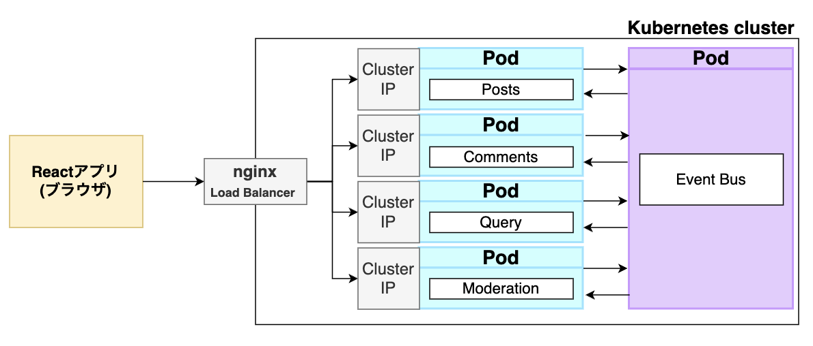
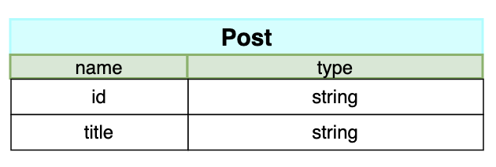
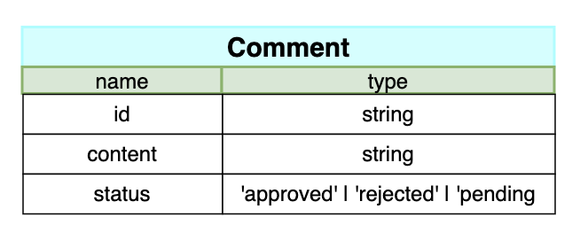

# microservice_blog

## 概要

これは下記のような機能を持つ簡易的なブログアプリです。
マイクロサービスの構築について学習するために作成しました。

- 投稿(Post)
- コメント(Comment)

## 技術スタック

- フロントエンド：React
- バックエンド：Node.js
- インフラ：Kubernetes, nginx

## 全体像

ブログアプリは posts・commets・client・query・moderation・event-bus によって構成されています。全体像は下記のようになっています。それぞれのサービスはマイクロサービスのアーキテクチャに従うため、サービス同士で直接通信を取らないようになっています。

## 投稿(posts)
新しい投稿を作成し、既存の投稿のリストを提供します。投稿が作成されると、PostCreated イベントがイベントバスに送信されます。
### データベース

## コメント(comments)
特定の投稿にコメントを追加します。コメントが作成されると、CommentCreated イベントがイベントバスに送信されます。
### データベース
statusはコメントの状態を示し、moderationでフィルタリングされたコメントが承認されたか拒否されたかを表します。

## client
ユーザーのフロントエンドインターフェースとして機能し、投稿の表示、コメントの追加などのユーザー操作を処理する。

## query
イベントバスからの PostCreated および CommentCreated イベントを受け取り、それに基づいてデータを更新します。また、投稿とそれに関連するコメントの統合されたビューを提供します。

## moderation
コメントの内容をモデレートし、不適切なコメントをフィルタリングします。モデレートが行われると、CommentModerated イベントがイベントバスに送信されます。

## event-bus
各サービス間でのイベントの送受信を処理します。サービスが特定のイベントを発行した場合、イベントバスはそのイベントを受け取り、適切なサービスにイベントを伝播します。